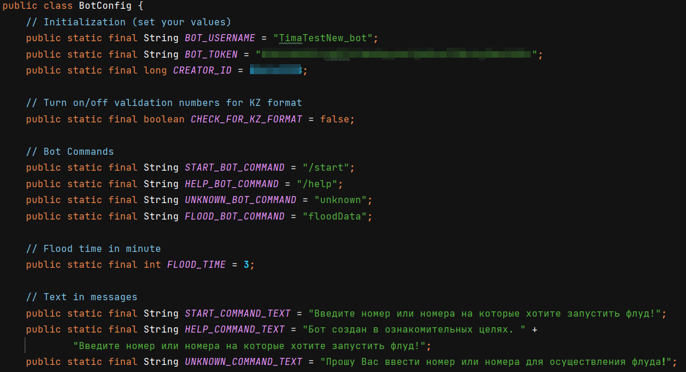
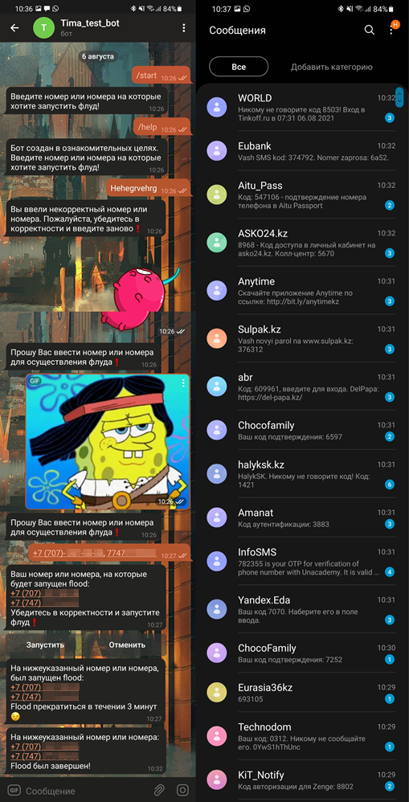

# Telegram Bot SMS Bomber 💣 (Java Library) 
Very simple telegram bot that uses [TelegramBots](https://github.com/rubenlagus/TelegramBots) library. The bot has 26 services for sending sms.

## Telegram Bot API
This library use [Telegram bot API](https://core.telegram.org/bots), you can find more information following the link.

## Bot app structure
Application architecture is designed using MVC pattern, which contains one model, nine controllers and one view.

```
java
├── info.securedev.telegram.bot
│   ├── controllers
│   │   ├── CommandHandlerController
│   │   ├── RouteController
│   │   ├── Command (interface)
│   │   ├── BaseCommandController (abstract class implements Command interface)
│   │   ├── StartCommandController (extends BaseCommandController)
│   │   ├── HelpCommandController (extends BaseCommandController)
│   │   ├── FloodDataCommandController (extends BaseCommandController)
│   │   ├── FloodStartCommandController (extends BaseCommandController)
│   │   ├── FloodCancelCommandController (extends BaseCommandController)
│   │   └── UnknownCommandController (extends BaseCommandController) 
│   ├── models
│   │   └── Model
│   ├── flood_services
│   │   ├── Flood (interface)
│   │   ├── FloodService.Builder (implements Flood)
│   │   └── FloodServiceFactory
│   ├── views
│   │   └── StartFlood
│   ├── settings
│   │   ├── BotConfig
│   │   └── RoutesContainer
│   ├── utils
│   │   ├── Message.Builder
│   │   └── ...
│   ├── MyBot
│   └── Main
└── pom.xml
```

- **Controllers** - CommandHandlerController and RouteController are base controllers, define which controller should be called next, depending on the input command. CommandHandlerController get command controllers from RouteController. RouteController get routes from RoutesContainer, which located in settings package. CommandСontrollers (like StartCommandController) are responsible for base logics for proccesing the command, like send message, interact with model, view, etc. This is all designed by factory method pattern.
- **Model** - contains ArrayLists of flood services and filtered input numbers.
- **View** - get data from model and start flood.
- **Flood_services** - FloodService.Builder class build objects for flood services, which send HTTP/HTTPS request with input numbers (Builder pattern). FloodServiceFactory class generate this objects and add in ArrayList.


## Config
Before compile project you need to add the [TelegramBots](https://github.com/rubenlagus/TelegramBots/wiki/Simple-Example) library to your project and create new bot with BotFather bot (if you don't have bot), set bot token, bot username and creater id (you can get with another bots) into BotConfig class, which located in settings package. And in this class you can turn on/of validation numbers for KZ format and change messages text, text in inline buttons, etc.



## Result

